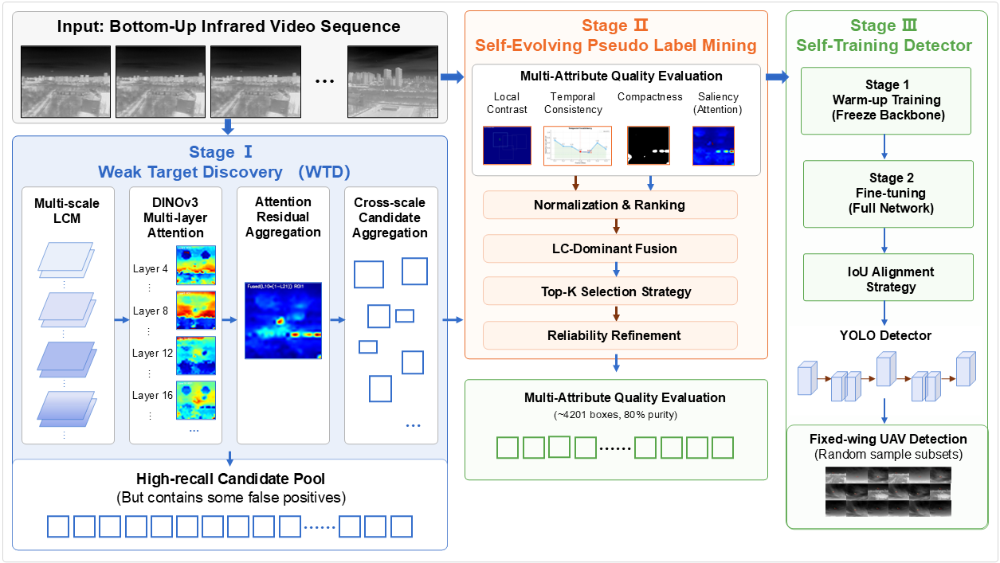

# SELD

<h2 align="center">
SELD: Self-Evolving Learning for Annotation-Free Bottom-Up Infrared Fixed-Wing Aircraft Discovery
</h2>

<p align="center">

Official repository of the paper:

**SELD: Self-Evolving Learning for Annotation-Free Bottom-Up Infrared Fixed-Wing Aircraft Discovery**

</p>

---

## 📖 Overview

SELD is an annotation-free learning framework for **bottom-up airborne infrared fixed-wing aircraft discovery**.

Unlike conventional supervised infrared target detection methods, SELD progressively discovers weak aircraft targets from completely unlabeled infrared videos through a self-evolving learning paradigm, enabling reliable detector learning without any human-provided annotations.

The proposed framework consists of three sequential stages:

- 🔹 Weak Target Discovery
- 🔹 Self-Evolving Pseudo Label Mining
- 🔹 Detector Self-training

SELD integrates infrared physical saliency, self-supervised semantic representations, temporal consistency, and geometric priors into a unified annotation-free learning framework.

---

## 🚀 Framework

<p align="center">

</p>

> **Figure.** Overall pipeline of SELD. The framework progressively transforms weak infrared target candidates into reliable pseudo labels and finally learns a detector through self-training.

*(The framework figure will be uploaded together with the source code.)*

---

## ✨ Highlights

- Annotation-free infrared aircraft discovery
- Bottom-up weak target discovery
- Self-evolving pseudo-label learning
- Multi-scale local contrast modeling
- Multi-layer Transformer attention fusion
- Progressive detector self-training
- Cross-dataset zero-shot generalization

---

## 📊 Experimental Results

SELD achieves state-of-the-art performance on the MMFW-UAV benchmark without using any manual annotations.

| Method | Recall | Precision | F1-score |
|---------|---------|-----------|----------|
| SELD | **91.38%** | **75.00%** | **82.10%** |

Furthermore, SELD demonstrates strong zero-shot generalization on the Anti-UAV410 benchmark.

---

## 📂 Dataset

Experiments are conducted on the following public datasets:

- **MMFW-UAV**
- **Anti-UAV410**

Please refer to the official dataset websites for downloading the datasets.

---

## 📦 Repository Status

🚧 **Under Construction**

The repository is currently being organized.

The following resources will be released after the paper is accepted:

- Source code
- Training scripts
- Inference scripts
- Pretrained models
- Evaluation toolbox
- Visualization examples

---

## 📅 Release Plan

- [x] Repository initialized
- [x] Project description
- [ ] Source code
- [ ] Training scripts
- [ ] Pretrained models
- [ ] Inference demo
- [ ] Evaluation scripts
- [ ] Documentation

---

## 📚 Citation

If you find this work useful, please consider citing:

```bibtex
@article{SELD,
  title={SELD: Self-Evolving Learning for Annotation-Free Bottom-Up Infrared Fixed-Wing Aircraft Discovery},
  author={Wang, Yani and Zhai, Zhengjun and Fu, Jiaxing and Ding, Shuhang},
  journal={To be released},
  year={2026}
}
```

*(The complete citation will be updated after publication.)*

---

## 📄 License

The source code will be released under an open-source license after the paper is accepted.
